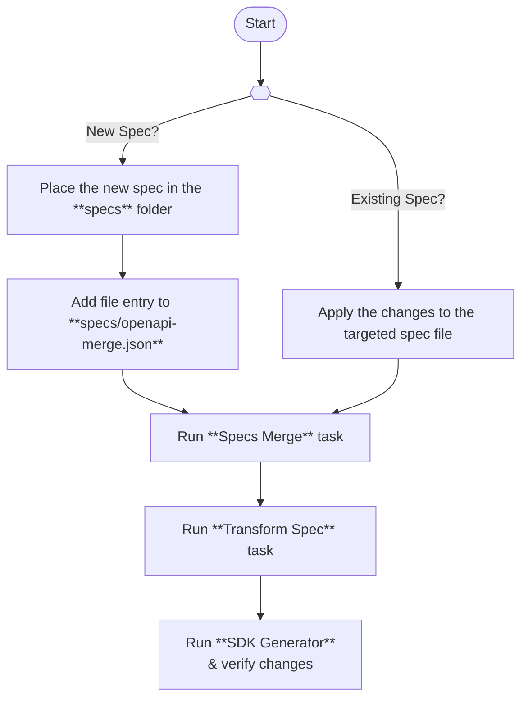

# XAP Java SDK Generator
The Generator module is a core component of the XAP Java SDK. It automatically produces SDK code from OpenAPI specifications.
It leverages the [Expedia Group SDK Generator](https://github.com/ExpediaGroup/expediagroup-java-sdk/tree/feature/new-sdk-core/expediagroup-sdk-openapi-plugin) to transform API specifications into type-safe, consistent, and well-documented client code.

The generator is customized to produce models and operations from the provided specification; requests execution logic is handled by other **manually-implemented** classes that delegates the request execution to an internal [Expedia Group SDK](https://github.com/ExpediaGroup/expediagroup-java-sdk/tree/feature/new-sdk-core) core modules.

---

## 📚 Table of Contents

1. [EG SDK Generator Plugin Configuration](#eg-sdk-generator-plugin-configuration)
2. [Key Tasks](#key-tasks)
3. [Generation Workflow](#generation-workflow)
4. [Custom Templates](#custom-templates)
   1. [Override Default Templates](#override-default-templates)
   2. [Add New Templates](#add-new-templates)
      1. [API Templates](#1-api-templates)
      2. [Supporting Templates](#2-supporting-templates)
5. [Output Directory](#output-directory)
6. [License](#license)

---

## EG SDK Generator Plugin Configuration
The generator plugin configurations are defined in `generator/build.gradle.kts` in the `egSdkGenerator` extension.

```kts
egSdkGenerator {
    namespace = "xap"
    basePackage = "com.expediagroup.sdk.xap"
    specFilePath = File("$rootDir/specs/transformed-spec.yaml")

    objectMapper = "com.expediagroup.sdk.xap.configuration.OBJECT_MAPPER"

    outputDir = File("$rootDir/xap-sdk/src/main/kotlin")
    customTemplatesDir = File("$projectDir/src/main/resources/templates")
}
```

## Key Tasks
The module provides several Gradle tasks to facilitate the code generation process:

| Task                | Description                                                                |
|---------------------|----------------------------------------------------------------------------|
| `mergeSpecs`        | Merges multiple OpenAPI spec files into a single `specs.yaml` file         |
| `transformSpecs`    | Transforms the merged spec file with Expedia Group-specific customizations |
| `generateEgSdk`     | Generates the SDK code from the transformed spec file                      |
| `generateAndFormat` | Generates SDK code and formats it with ktlint                              |

## Generation Workflow
XAP Java SDK is generated from a collection of OpenAPI specifications that are merged and transformed into a single spec file.
The final transformed spec file is then fed to the SDK generator.

> [!CAUTION]
> Some tasks invoke `npx` under the hood, so ensure `npm` is installed.

A typical workflow to generate new models and operations involves the following steps:

#### Step 1 – Add or update specs

> [!NOTE]
> If the spec is a new, it should be added to the `specs/openapi-merge.json` file.

#### Step 2 – Merge the specs
```bash
./gradlew :generator:mergeSpecs
```

This task merges all OpenAPI spec files into a single `specs.yaml` file.

#### Step 3 - Transform the merged spec

```bash
./gradlew :generator:transformSpecs
```

This task transforms the merged spec file into a single file `transformed-spec.yaml` suitable for the SDK generator.
   
#### Step 4 - Generate and format the SDK code
```bash
./gradlew :generator:generateAndFormat

# Or without formatting

./gradlew :generator:generateEgSdk
```

This task generates the SDK code based on the transformed spec file and places it in the specified output directory.
   
### Generation Overview


## Custom Templates

Expedia Group XAP SDK generator allows users to define custom Mustache templates for code generation.
You can supply Mustache templates to customise or extend the generated code. Custom templates either override a default file or add new artifacts.

### Override Default Templates
To override the default templates, the custom templates should match the name and location of the default templates in the generator plugin.
You can find the generator's default templates [here](https://github.com/ExpediaGroup/expediagroup-java-sdk/tree/feature/new-sdk-core/expediagroup-sdk-openapi-plugin/src/main/resources/templates)

As a living example, XAP SDK overrides the [`operations/params/builder.mustache`](src/main/resources/templates/operations/params/builder.mustache) template.

The generator plugin will pick up the custom templates automatically without any additional configuration needed.

### Add New Templates
The OpenAPI generator allows adding new templates for specific use cases. There are two types of templates that can be added:

#### 1. API Templates
Templates that the generator invokes for each API operation.

```kts
egSdkGenerator {
    apiTemplates = listOf(
        ApiTemplate(
            // Template file name - relative to the customTemplatesDir
            templateFile = "my-custom-api-template.mustache",

            // output destination - relative to the outputDir
            destinationPath = "com/expediagroup/sdk/xap/operation/custom",

            // Optional suffix appended to the generated file name. The base name is the operation name.
            fileNameSuffix = "CustomOperation.kt",
        ),
    )
}
```

#### 2. Supporting Templates
Templates that the generator invokes once to generate the supporting code for the SDK.

```kts
egSdkGenerator {
    supportingTemplates = listOf(
        SupportingTemplate(
            // Template file name - relative to the customTemplatesDir
            templateFile = "room.mustache",

            // output destination - relative to the outputDir
            destinationPath = "com/expediagroup/sdk/xap/model",

            // The name of the generated file
            fileName = "Room.kt",
        ),
    )
}
```

## Output Directory
The generator produces code that is integrated into the main `xap-sdk` module (`src/main/kotlin`).


## License
This module is part of the **XAP Java SDK** and distributed under the [Apache 2.0](../LICENSE) license.
